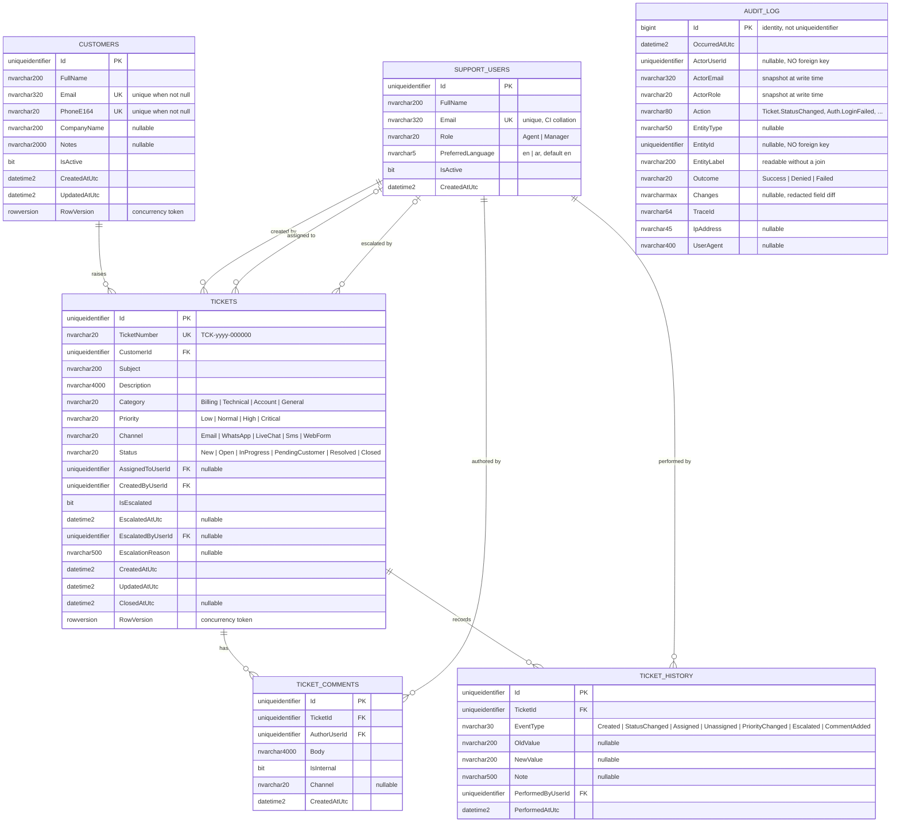

# Domain Model

This file is the single source of truth for entities, relationships, and persistence
concerns. Story artifacts refer to it rather than redefining it.

## Entity relationship diagram



`AUDIT_LOG` appears in the diagram with **no connecting lines**. That is not an
omission — it is the design. It has no foreign keys, deliberately, so that it can
record the deletion of a row and still exist afterwards. See
`decisions/ADR-008-audit-log.md`.

### Plain-text view

For readers whose viewer does not render Mermaid.

```text
                        ┌──────────────────────┐
                        │    SupportUsers      │
                        │──────────────────────│
                        │ Id            PK     │
                        │ FullName             │
                        │ Email         UK     │
                        │ Role                 │
                        │ PreferredLanguage    │
                        │ IsActive             │
                        └──────────┬───────────┘
                                   │
        ┌──────────────────────────┼──────────────────────────┐
        │ CreatedByUserId          │ AuthorUserId             │ PerformedByUserId
        │ AssignedToUserId (null)  │                          │
        │ EscalatedByUserId (null) │                          │
        │                          │                          │
        ▼                          ▼                          ▼
┌───────────────────┐    ┌──────────────────┐    ┌────────────────────┐
│     Tickets       │    │  TicketComments  │    │   TicketHistory    │
│───────────────────│1  *│──────────────────│    │────────────────────│
│ Id           PK   ├───►│ Id          PK   │    │ Id            PK   │
│ TicketNumber UK   │    │ TicketId    FK   │    │ TicketId      FK   │
│ CustomerId   FK   │    │ AuthorUserId FK  │    │ EventType          │
│ Subject           │    │ Body             │    │ OldValue           │
│ Description       │    │ IsInternal       │    │ NewValue           │
│ Category          │    │ Channel   (null) │    │ Note               │
│ Priority          │1  *│ CreatedAtUtc     │    │ PerformedByUserId  │
│ Channel           ├────┴──────────────────┴───►│ PerformedAtUtc     │
│ Status            │                            └────────────────────┘
│ AssignedToUserId  │
│ IsEscalated       │
│ ClosedAtUtc       │
│ RowVersion        │
└─────────▲─────────┘
          │ CustomerId
        * │
          │ 1
┌─────────┴─────────┐
│     Customers     │
│───────────────────│
│ Id           PK   │
│ FullName          │
│ Email        UK   │  unique when not null
│ PhoneE164    UK   │  unique when not null
│ CompanyName       │
│ Notes             │
│ IsActive          │
│ RowVersion        │
└───────────────────┘


   ┌──────────────────────┐
   │      AuditLog        │   no foreign keys — deliberately
   │──────────────────────│   (ADR-008)
   │ Id            PK     │   bigint identity
   │ OccurredAtUtc        │
   │ ActorUserId          │   uniqueidentifier, NOT a FK
   │ ActorEmail           │   snapshot
   │ ActorRole            │   snapshot
   │ Action               │   Ticket.StatusChanged, Auth.LoginFailed
   │ EntityType           │
   │ EntityId             │   uniqueidentifier, NOT a FK
   │ EntityLabel          │   TCK-2026-000042
   │ Outcome              │   Success | Denied | Failed
   │ Changes       nvarcharmax  │   redacted field diff
   │ TraceId              │
   │ IpAddress            │
   │ UserAgent            │
   └──────────────────────┘
```

### Relationships and delete behaviour

| From | To | Cardinality | Foreign key | On delete | Reason |
|---|---|---|---|---|---|
| `Customers` | `Tickets` | 1 → 0..* | `CustomerId` | **Restrict** | Deleting a customer must not silently erase their support history |
| `Tickets` | `TicketComments` | 1 → 0..* | `TicketId` | **Cascade** | A comment has no meaning without its ticket |
| `Tickets` | `TicketHistory` | 1 → 1..* | `TicketId` | **Cascade** | Same; a ticket always has at least the `Created` row |
| `SupportUsers` | `Tickets` | 1 → 0..* | `CreatedByUserId` | **Restrict** | The author of a ticket must remain resolvable |
| `SupportUsers` | `Tickets` | 0..1 → 0..* | `AssignedToUserId` | **Restrict** | Nullable: an unassigned ticket is normal |
| `SupportUsers` | `Tickets` | 0..1 → 0..* | `EscalatedByUserId` | **Restrict** | Nullable: most tickets are never escalated |
| `SupportUsers` | `TicketComments` | 1 → 0..* | `AuthorUserId` | **Restrict** | An author who has left must still display |
| `SupportUsers` | `TicketHistory` | 1 → 0..* | `PerformedByUserId` | **Restrict** | The audit trail must never lose its actor |

| `AuditLog` | — | — | none | **No FK at all** | An audit row must outlive the thing it describes, so it cannot be constrained by it (ADR-008) |

Nothing is ever hard-deleted in the application; `IsActive` handles departures and
deactivations. The delete rules above describe what the database would enforce if a
delete were ever attempted by hand during support work — which is precisely when a
missing constraint does the most damage.

### Three foreign keys from `Tickets` to `SupportUsers`

`CreatedByUserId`, `AssignedToUserId`, and `EscalatedByUserId` all point at the same
table. Two consequences worth naming, because both are easy to get wrong quietly:

- **EF Core** cannot infer three relationships to one entity. Each needs an explicit
  `HasOne(...).WithMany().HasForeignKey(...)` with a distinct navigation or none at
  all. Left to convention, it invents shadow properties and the migration produces
  columns nobody intended.
- **Cascade paths.** If any of the three cascaded, there would be multiple cascade
  paths from `SupportUsers` into `Tickets` and onward into `TicketComments`.
  SQL Server rejects multiple cascade paths outright at creation time. Using
  `Restrict` (`ON DELETE NO ACTION`) on all three is correct on its own merits, and under
  SQL Server it is what makes the schema creatable at all — see `decisions/ADR-013-database-sql-server.md`.

### No lookup tables

`Category`, `Priority`, `Channel`, `Status`, `Role`, and `EventType` are enums stored
as strings, not foreign keys to lookup tables.

Lookup tables would be the right choice if these values were data the business edits
at runtime. They are not — each one has behaviour attached in code. `Status` drives
the state machine in BR-1, `Role` drives the authorization matrix in BR-6, and adding
a value to either means writing code regardless. A lookup table would create the
illusion that a new status could be added by inserting a row, which would produce a
ticket the state machine cannot move.

The cost is that the database does not constrain these columns to their valid values.
That is accepted: the domain is the constraint, and it is the layer that has to be
right anyway.

### Sequence

```text
ticket_number_seq   →   formatted by the application as TCK-{yyyy}-{seq:000000}
```

Not a table, and not derived from a row count. The reasoning is under **Ticket number
generation** below.

## Entities

### SupportUser

Represents an internal user of the CRM (agent or manager).

| Field | Type | Notes |
|---|---|---|
| `Id` | `Guid` | Primary key |
| `FullName` | `string(200)` | Required |
| `Email` | `string(320)` | Required, unique, normalised lowercase |
| `Role` | `SupportRole` | `Agent` or `Manager` |
| `PreferredLanguage` | `string(5)` | `en` or `ar`; defaults to `en`. Persisted so the choice follows the user across devices |
| `IsActive` | `bool` | Inactive users cannot be assigned new tickets |
| `CreatedAtUtc` | `DateTime` | |

Seeded at startup for the MVP; there is no user-management UI.

### Customer

| Field | Type | Notes |
|---|---|---|
| `Id` | `Guid` | Primary key |
| `FullName` | `string(200)` | Required |
| `Email` | `string(320)?` | Optional, normalised lowercase, unique when present |
| `PhoneE164` | `string(20)?` | Optional, stored in E.164, unique when present |
| `CompanyName` | `string(200)?` | Optional |
| `Notes` | `string(2000)?` | Optional free text |
| `IsActive` | `bool` | Soft-delete flag; no hard delete in the MVP |
| `CreatedAtUtc` | `DateTime` | |
| `UpdatedAtUtc` | `DateTime` | |
| `Version` | concurrency token | See `decisions/ADR-006-concurrency.md` |

**Invariant:** at least one of `Email` or `PhoneE164` must be present.

### Ticket

| Field | Type | Notes |
|---|---|---|
| `Id` | `Guid` | Primary key |
| `TicketNumber` | `string(20)` | Unique, human readable, e.g. `TCK-2026-000042` |
| `CustomerId` | `Guid` | Required, foreign key, restrict on delete |
| `Subject` | `string(200)` | Required |
| `Description` | `string(4000)` | Required |
| `Category` | `TicketCategory` | Required |
| `Priority` | `TicketPriority` | Required, defaults to `Normal` |
| `Channel` | `CommunicationChannel` | Required, origin of the ticket |
| `Status` | `TicketStatus` | Starts at `New` |
| `AssignedToUserId` | `Guid?` | Null while unassigned |
| `IsEscalated` | `bool` | Defaults to false |
| `EscalatedAtUtc` | `DateTime?` | |
| `EscalatedByUserId` | `Guid?` | |
| `EscalationReason` | `string(500)?` | Required when escalating |
| `CreatedByUserId` | `Guid` | |
| `CreatedAtUtc` | `DateTime` | |
| `UpdatedAtUtc` | `DateTime` | |
| `ClosedAtUtc` | `DateTime?` | Set when status becomes `Closed` |
| `Version` | concurrency token | |

### TicketComment

| Field | Type | Notes |
|---|---|---|
| `Id` | `Guid` | Primary key |
| `TicketId` | `Guid` | Required, cascade delete with ticket |
| `AuthorUserId` | `Guid` | Required |
| `Body` | `string(4000)` | Required, non-whitespace |
| `IsInternal` | `bool` | Internal notes are not customer-visible |
| `Channel` | `CommunicationChannel?` | Set when the comment represents an inbound or outbound interaction |
| `CreatedAtUtc` | `DateTime` | |

Comments are append-only in the MVP: no edit, no delete.

### TicketHistory

Immutable audit trail. Written by the application layer in the same transaction as
the change it describes.

| Field | Type | Notes |
|---|---|---|
| `Id` | `Guid` | Primary key |
| `TicketId` | `Guid` | Required |
| `EventType` | `TicketEventType` | See enum below |
| `OldValue` | `string(200)?` | Previous value, as text |
| `NewValue` | `string(200)?` | New value, as text |
| `Note` | `string(500)?` | Optional reason supplied by the actor |
| `PerformedByUserId` | `Guid` | |
| `PerformedAtUtc` | `DateTime` | |

### AuditLog

The forensic record. Append-only, never deleted, and reachable only by a Manager.
Distinct from `TicketHistory` — see `decisions/ADR-008-audit-log.md` for why both
exist.

| Field | Type | Notes |
|---|---|---|
| `Id` | `long` | Identity primary key. The only non-`uuid` key in the schema; append-only, high-volume, always read in time order |
| `OccurredAtUtc` | `DateTime` | |
| `ActorUserId` | `Guid?` | Null for anonymous events such as a failed sign-in. **No foreign key** |
| `ActorEmail` | `string(320)?` | Snapshot at write time |
| `ActorRole` | `string(20)?` | Snapshot at write time — the role held *then*, not now |
| `Action` | `string(80)` | `Entity.Verb`, e.g. `Ticket.StatusChanged`, `Customer.Updated`, `Auth.LoginFailed`, `Auth.Forbidden` |
| `EntityType` | `string(50)?` | `Ticket`, `Customer`, `SupportUser` |
| `EntityId` | `Guid?` | **No foreign key** |
| `EntityLabel` | `string(200)?` | A readable handle such as `TCK-2026-000042`, so the row means something without a join |
| `Outcome` | `AuditOutcome` | `Success`, `Denied`, `Failed` |
| `Changes` | `string?` (`nvarchar(max)`, JSON) | Field-level before and after, redacted per BR-9.7 |
| `TraceId` | `string(64)` | Matches the `traceId` in `ProblemDetails` and the request log |
| `IpAddress` | `IPAddress?` | |
| `UserAgent` | `string(400)?` | |

**Why the actor is snapshotted and not joined:** an audit log that resolves the actor
through a foreign key reports their role *today*. Promote an agent to manager and every
action they ever took retroactively looks like a manager's action — which inverts the
answer to every authorization question an auditor would ask.

## Enums

```text
SupportRole            = Agent | Manager

TicketStatus           = New | Open | InProgress | PendingCustomer | Resolved | Closed

TicketPriority         = Low | Normal | High | Critical      (ordered, low to high)

TicketCategory         = Billing | Technical | Account | General

CommunicationChannel   = Email | WhatsApp | LiveChat | Sms | WebForm

TicketEventType        = Created | StatusChanged | Assigned | Unassigned
                       | PriorityChanged | Escalated | CommentAdded

AuditOutcome           = Success | Denied | Failed
```

Enums are persisted as strings, not integers, so that a database dump is readable
and reordering the enum cannot silently corrupt existing rows.

Enum **values** are never translated. `InProgress` is an identifier and travels over
the wire as `InProgress` in every locale; only its display label is translated, and
that label lives in the client's catalogue. Translating the value would make the
stored data locale-dependent and every filter locale-specific.

## What is not translated

| Data | Reason |
|---|---|
| `Customer.FullName`, `CompanyName`, `Notes` | Entered by a user; stored verbatim |
| `Ticket.Subject`, `Description` | Entered by a user; stored verbatim |
| `TicketComment.Body` | Entered by a user; stored verbatim |
| `TicketHistory.OldValue`, `NewValue` | Canonical enum values, translated at display time |
| `TicketNumber` | An identifier that is quoted aloud and pasted; Latin digits in every locale |

Free text is stored in whatever language it was written and may mix both. The client
renders it with `dir="auto"` so an Arabic comment reads correctly inside an English
interface, and the reverse.

## Ticket number generation

A database sequence produces the numeric part; the application formats it as
`TCK-{yyyy}-{seq:000000}` at insert time. The sequence is not reset per year — the
year is informational only, so the value stays unique and monotonic.

Rationale: a `Guid` is unusable in a phone conversation with a customer, and a
`COUNT(*) + 1` is a race condition.

## Indexes and constraints

| Table | Index / constraint | Reason |
|---|---|---|
| `Customers` | Filtered unique index on `Email` where `Email IS NOT NULL AND IsActive = 1` | Duplicate rule (BR-4.4). The stored value is already trimmed and lowercased by BR-4.2, and the column carries a case-insensitive collation, so no `LOWER()` expression is needed — SQL Server cannot filter on an expression anyway |
| `Customers` | Filtered unique index on `PhoneE164` where `PhoneE164 IS NOT NULL AND IsActive = 1` | Duplicate rule (BR-4.5) |
| `Customers` | Check: `Email IS NOT NULL OR PhoneE164 IS NOT NULL` | Contact invariant (BR-4.1) |
| `Customers` | Index on `FullName` | Customer search |
| `Tickets` | Unique index on `TicketNumber` | Lookup by number |
| `Tickets` | Index on `(Status, CreatedAtUtc DESC)` | Default list query |
| `Tickets` | Index on `CustomerId` | Customer overview |
| `Tickets` | Index on `AssignedToUserId` | "My tickets" filter |
| `TicketComments` | Index on `(TicketId, CreatedAtUtc)` | Timeline query |
| `TicketHistory` | Index on `(TicketId, PerformedAtUtc)` | Timeline query |
| `SupportUsers` | Unique index on `Email` (case-insensitive collation) | Identity |
| `AuditLog` | Index on `(OccurredAtUtc DESC)` | "What happened recently" |
| `AuditLog` | Index on `(EntityType, EntityId, OccurredAtUtc DESC)` | "Everything that touched this record" |
| `AuditLog` | Index on `(ActorUserId, OccurredAtUtc DESC)` | "Everything this person did" |
| `AuditLog` | Filtered index on `(OccurredAtUtc DESC)` where `Outcome <> 'Success'` | "Show me denials and failures" — the query that actually matters after an incident, and the one that would otherwise scan a table dominated by successes |

Every index above exists because a named query needs it. No speculative indexes.

**Verifying them.** After a migration, the filters are the part that silently goes
missing, so check them rather than assuming:

```sql
SELECT  i.name, i.is_unique, i.filter_definition
FROM    sys.indexes i
WHERE   i.object_id = OBJECT_ID('dbo.Customers');
```

A filtered index whose `filter_definition` comes back `NULL` was created without its
`WHERE` clause. It will then reject the second customer who happens to have no email,
which reads as a duplicate-detection bug and is actually a migration defect.

## Physical shape

The tables as SQL Server will create them, per `decisions/ADR-013-database-sql-server.md`.
This is a reference sketch, not the migration — EF Core generates the migration from the
entity configurations, and if the two ever disagree, the generated migration is the
truth and this section is the defect.

```sql
CREATE TABLE dbo.SupportUsers (
    Id                 uniqueidentifier NOT NULL PRIMARY KEY,
    FullName           nvarchar(200)    NOT NULL,
    Email              nvarchar(320)    COLLATE Latin1_General_100_CI_AS NOT NULL,
    PasswordHash       nvarchar(400)    NOT NULL,
    Role               nvarchar(20)     NOT NULL,
    PreferredLanguage  nvarchar(5)      NOT NULL CONSTRAINT DF_SupportUsers_Lang DEFAULT 'en',
    IsActive           bit              NOT NULL CONSTRAINT DF_SupportUsers_Active DEFAULT 1,
    CreatedAtUtc       datetime2(3)     NOT NULL,
    RowVersion         rowversion       NOT NULL
);
CREATE UNIQUE INDEX UX_SupportUsers_Email ON dbo.SupportUsers (Email);

CREATE TABLE dbo.Customers (
    Id            uniqueidentifier NOT NULL PRIMARY KEY,
    FullName      nvarchar(200)    NOT NULL,
    Email         nvarchar(320)    COLLATE Latin1_General_100_CI_AS NULL,
    PhoneE164     nvarchar(20)     NULL,
    CompanyName   nvarchar(200)    NULL,
    Notes         nvarchar(2000)   NULL,
    IsActive      bit              NOT NULL CONSTRAINT DF_Customers_Active DEFAULT 1,
    CreatedAtUtc  datetime2(3)     NOT NULL,
    UpdatedAtUtc  datetime2(3)     NOT NULL,
    RowVersion    rowversion       NOT NULL,
    CONSTRAINT CK_Customers_Contact
        CHECK (Email IS NOT NULL OR PhoneE164 IS NOT NULL)
);
CREATE UNIQUE INDEX UX_Customers_Email ON dbo.Customers (Email)
    WHERE Email IS NOT NULL AND IsActive = 1;
CREATE UNIQUE INDEX UX_Customers_Phone ON dbo.Customers (PhoneE164)
    WHERE PhoneE164 IS NOT NULL AND IsActive = 1;
CREATE INDEX IX_Customers_FullName ON dbo.Customers (FullName);

CREATE SEQUENCE dbo.TicketNumberSeq AS bigint START WITH 1 INCREMENT BY 1;

CREATE TABLE dbo.Tickets (
    Id                 uniqueidentifier NOT NULL PRIMARY KEY,
    TicketNumber       nvarchar(20)     NOT NULL,
    CustomerId         uniqueidentifier NOT NULL
        CONSTRAINT FK_Tickets_Customers REFERENCES dbo.Customers (Id) ON DELETE NO ACTION,
    Subject            nvarchar(200)    NOT NULL,
    Description        nvarchar(4000)   NOT NULL,
    Category           nvarchar(20)     NOT NULL,
    Priority           nvarchar(20)     NOT NULL CONSTRAINT DF_Tickets_Priority DEFAULT 'Normal',
    Channel            nvarchar(20)     NOT NULL,
    Status             nvarchar(20)     NOT NULL CONSTRAINT DF_Tickets_Status   DEFAULT 'New',
    AssignedToUserId   uniqueidentifier NULL
        CONSTRAINT FK_Tickets_Assignee  REFERENCES dbo.SupportUsers (Id) ON DELETE NO ACTION,
    CreatedByUserId    uniqueidentifier NOT NULL
        CONSTRAINT FK_Tickets_Creator   REFERENCES dbo.SupportUsers (Id) ON DELETE NO ACTION,
    IsEscalated        bit              NOT NULL CONSTRAINT DF_Tickets_Escalated DEFAULT 0,
    EscalatedAtUtc     datetime2(3)     NULL,
    EscalatedByUserId  uniqueidentifier NULL
        CONSTRAINT FK_Tickets_Escalator REFERENCES dbo.SupportUsers (Id) ON DELETE NO ACTION,
    EscalationReason   nvarchar(500)    NULL,
    CreatedAtUtc       datetime2(3)     NOT NULL,
    UpdatedAtUtc       datetime2(3)     NOT NULL,
    ClosedAtUtc        datetime2(3)     NULL,
    RowVersion         rowversion       NOT NULL
);
CREATE UNIQUE INDEX UX_Tickets_Number       ON dbo.Tickets (TicketNumber);
CREATE INDEX IX_Tickets_Status_Created      ON dbo.Tickets (Status, CreatedAtUtc DESC);
CREATE INDEX IX_Tickets_Customer            ON dbo.Tickets (CustomerId);
CREATE INDEX IX_Tickets_Assignee            ON dbo.Tickets (AssignedToUserId);

CREATE TABLE dbo.TicketComments (
    Id            uniqueidentifier NOT NULL PRIMARY KEY,
    TicketId      uniqueidentifier NOT NULL
        CONSTRAINT FK_TicketComments_Tickets REFERENCES dbo.Tickets (Id) ON DELETE CASCADE,
    AuthorUserId  uniqueidentifier NOT NULL
        CONSTRAINT FK_TicketComments_Author  REFERENCES dbo.SupportUsers (Id) ON DELETE NO ACTION,
    Body          nvarchar(4000)   NOT NULL,
    IsInternal    bit              NOT NULL CONSTRAINT DF_TicketComments_Internal DEFAULT 0,
    Channel       nvarchar(20)     NULL,
    CreatedAtUtc  datetime2(3)     NOT NULL
);
CREATE INDEX IX_TicketComments_Ticket_Time
    ON dbo.TicketComments (TicketId, CreatedAtUtc);

CREATE TABLE dbo.TicketHistory (
    Id                  uniqueidentifier NOT NULL PRIMARY KEY,
    TicketId            uniqueidentifier NOT NULL
        CONSTRAINT FK_TicketHistory_Tickets REFERENCES dbo.Tickets (Id) ON DELETE CASCADE,
    EventType           nvarchar(30)     NOT NULL,
    OldValue            nvarchar(200)    NULL,
    NewValue            nvarchar(200)    NULL,
    Note                nvarchar(500)    NULL,
    PerformedByUserId   uniqueidentifier NOT NULL
        CONSTRAINT FK_TicketHistory_Actor  REFERENCES dbo.SupportUsers (Id) ON DELETE NO ACTION,
    PerformedAtUtc      datetime2(3)     NOT NULL
);
CREATE INDEX IX_TicketHistory_Ticket_Time
    ON dbo.TicketHistory (TicketId, PerformedAtUtc);

CREATE TABLE dbo.AuditLog (
    Id             bigint           IDENTITY(1,1) NOT NULL PRIMARY KEY,
    OccurredAtUtc  datetime2(3)     NOT NULL,
    ActorUserId    uniqueidentifier NULL,
    ActorEmail     nvarchar(320)    NULL,
    ActorRole      nvarchar(20)     NULL,
    Action         nvarchar(80)     NOT NULL,
    EntityType     nvarchar(50)     NULL,
    EntityId       uniqueidentifier NULL,
    EntityLabel    nvarchar(200)    NULL,
    Outcome        nvarchar(20)     NOT NULL,
    Changes        nvarchar(max)    NULL,
    TraceId        varchar(64)      NOT NULL,
    IpAddress      varchar(45)      NULL,
    UserAgent      nvarchar(400)    NULL,
    CONSTRAINT CK_AuditLog_ChangesIsJson
        CHECK (Changes IS NULL OR ISJSON(Changes) = 1)
);
CREATE INDEX IX_AuditLog_Time
    ON dbo.AuditLog (OccurredAtUtc DESC);
CREATE INDEX IX_AuditLog_Entity
    ON dbo.AuditLog (EntityType, EntityId, OccurredAtUtc DESC);
CREATE INDEX IX_AuditLog_Actor
    ON dbo.AuditLog (ActorUserId, OccurredAtUtc DESC);
CREATE INDEX IX_AuditLog_NotSuccess
    ON dbo.AuditLog (OccurredAtUtc DESC) WHERE Outcome <> 'Success';

GRANT INSERT, SELECT      ON dbo.AuditLog TO wasl_app;
DENY  UPDATE, DELETE      ON dbo.AuditLog TO wasl_app;
```

Note the `DENY`. Append-only is enforced by the database permission the application
connects with, not by the application remembering not to. A rule that depends on every
future developer knowing about it is not a rule. `DENY` rather than `REVOKE` because
`DENY` outranks a grant inherited from role membership, so it cannot be undone by
someone adding the login to `db_datawriter` later.

Notes on the choices worth defending:

- **`RowVersion` on `SupportUsers`, `Customers`, and `Tickets` only.** ADR-006 requires
  optimistic concurrency on the entities that two people edit at once. `TicketComments`,
  `TicketHistory`, and `AuditLog` are append-only, so there is nothing to conflict over.
- **`nvarchar` everywhere a human writes.** Arabic in a `varchar` column under a
  non-Arabic collation becomes `????`, and it presents as a font or encoding problem
  rather than a schema one — which is exactly why it survives review. `TraceId`,
  `IpAddress`, and `UserAgent` stay `varchar`: they are ASCII by definition.
- **`datetime2(3)`, not `datetime`.** `datetime` rounds to 3.33ms and starts at 1753.
  `datetime2(3)` gives millisecond precision at the same storage cost as `datetime`.
  Time-zone intent is carried by the `*Utc` suffix plus a global EF value converter that
  stamps `DateTimeKind.Utc`, which is what PostgreSQL's `timestamptz` was buying us
  before ADR-013.
- **A case-insensitive collation on `Email` only.** Not database-wide. `FullName`,
  `Subject`, and comment bodies keep the server default, because a blanket
  case-insensitive collation changes comparison semantics for every column, including
  ones where it was never wanted.
- **No `CHECK` constraints on the enum columns.** Deliberate; see **No lookup tables**
  above.
- **`ON DELETE NO ACTION` on every `SupportUsers` reference.** A ticket outliving the
  agent who created it is normal; deleting the agent must fail rather than cascade
  through the ticket history.
- **`ON DELETE CASCADE` from `TicketComments` and `TicketHistory` to `Tickets` only.**
  Two cascade paths into the same table would be rejected by SQL Server; there are none
  here because `Tickets → Customers` is `NO ACTION`.
- **`ISJSON` on `AuditLog.Changes`.** SQL Server has no `jsonb`, so the check is what
  keeps a malformed diff out of the column that ADR-013 downgraded to `nvarchar(max)`.

## Query-to-index map

Every index earns its place by serving a named query. If a query is removed, its
index should be removed with it.

| Query | Story | Index used |
|---|---|---|
| Duplicate check on email | US-001 | `ux_customers_email` |
| Duplicate check on phone | US-001 | `ux_customers_phone` |
| Customer search by name | US-002 | `ix_customers_full_name` (substring search will not use it — see the note in that story's plan) |
| Default ticket list, sorted newest first | US-006 | `ix_tickets_status_created` |
| Tickets for one customer | US-004 | `ix_tickets_customer` |
| "My tickets" | US-006 | `ix_tickets_assignee` |
| Lookup by ticket number | US-006 | `ux_tickets_number` |
| Ticket timeline, comment side | US-010 | `ix_ticket_comments_ticket_time` |
| Ticket timeline, history side | US-010 | `ix_ticket_history_ticket_time` |
| Sign in by email | Auth | `ux_support_users_email` |
| Recent activity across the system | US-015 | `ix_audit_log_time` |
| Everything that touched one record | US-015 | `ix_audit_log_entity` |
| Everything one person did | US-015 | `ix_audit_log_actor` |
| Denials and failures only | US-015 | `ix_audit_log_not_success` |

`SupportUser.PreferredLanguage` has no index: it is read as part of the user row by
primary key and is never a filter.
